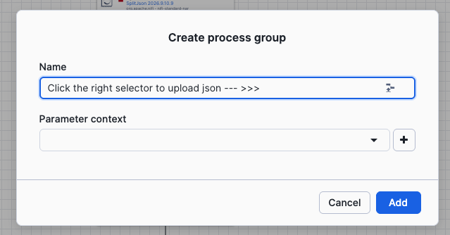

# TechUp27 — Usecase 1: Openflow REST API Example

**"User Spending Enrichment"** — Join two REST APIs into Snowflake with Openflow

| | |
|---|---|
| **Duration** | 25–30 minutes |
| **Audience** | First-time Openflow users |
| **Source APIs** | [DummyJSON Users](https://dummyjson.com/users) + [DummyJSON Carts](https://dummyjson.com/carts) (free, no auth) |

---

## Goal

Build a data integration pipeline that fetches user data from one API endpoint,
enriches each user with their shopping cart from a second API call, and writes
the joined result into Snowflake — both a regular table and an Iceberg table — all without writing code.

---

## Files

| File | Description |
|------|-------------|
| `techup27_setup.sql` | SQL script to provision the environment. Run as ACCOUNTADMIN **before** the lab. |
| `techup27_cleanup.sql` | SQL script to tear down all lab objects **after** the lab. |
| `techup27_flow.json` | Working solution as an exportable NiFi flow definition. Import via drag-and-drop or "Create Process Group" > "Import" in the NiFi UI. Use as a reference if stuck. |
| `README.md` | This file — overview + step-by-step build guide. |

---

## Prerequisites (complete before the session)

1. **Before session prerequisites script**
This should be completed before the session. Skip this step if already completed. If you haven't already, run the [`prerequisites.sql`](../prerequisites.sql) in a Snowflake SQL Worksheet. This creates:

   - **OPENFLOW_ADMIN** role with required grants
   - **OPENFLOW** database and schema for the runtime
   - **Openflow Deployment** and **Runtime** (SPCS-backed, takes ~20 min to provision)

      The runtime is suspended at the end of the script — each use case will resume it when needed.

2. **Run [`1.techup27_setup.sql`](1.techup27_setup.sql) as ACCOUNTADMIN** — creates database, tables, EAI, and grants for the lab

3. **Set your default user to OPENFLOW_ADMIN** 
   **Important:** Users whose **default role** is ACCOUNTADMIN cannot log in to the Openflow runtime. You must change your default role before accessing the canvas:
   ```sql
   ALTER USER <your_user> SET DEFAULT_ROLE = OPENFLOW_ADMIN;
   ALTER USER <your_user> SET DEFAULT_SECONDARY_ROLES = ('ALL');
   ```
4. **Verify runtime is accessible** — open the NiFi canvas from Snowsight (Ingestion > Openflow > Launch Openflow > Runtimes > View Canvas).

---

## APIs Used

Both APIs are on the same host (`dummyjson.com`), free, no authentication required.

| API | URL |
|-----|-----|
| Users | `GET https://dummyjson.com/users?limit=30&select=id,firstName,lastName,email,address` |
| Carts | `GET https://dummyjson.com/carts/user/{userId}` |

---

## What You Will Learn

### 1. NiFi Canvas Basics
- Creating a Process Group
- Adding and configuring processors
- Connecting processors via relationships
- Controller Services (what they are, how to create and enable them)

### 2. FlowFile Concepts
- Content vs Attributes (the two parts of every FlowFile)
- How data moves through processors as FlowFiles
- How processors read/write content vs attributes

### 3. REST API Ingestion Pattern
- Using InvokeHTTP to call external APIs
- Handling JSON array responses with SplitJson
- Extracting fields with EvaluateJsonPath

### 4. Data Enrichment / Lookup Pattern
- Using attributes from one API call to parameterize a second call
- Expression Language basics (`${user_id}` in URLs)
- Joining data from two sources into a single record

### 5. Writing to Snowflake with Snowpipe Streaming
- PublishSnowpipeStreaming (High-Performance Architecture — best practice)
- Why AttributesToJSON is needed (content vs attributes)
- Authentication via `SNOWFLAKE_MANAGED` on SPCS
- Table constraints (no DEFAULT columns with Snowpipe Streaming)
- Pipe naming convention (`<TABLE_NAME>-STREAMING`, auto-created)

### 6. External Access Integration (EAI)
- Why SPCS runtimes need EAI for external network access
- Network Rules (host:port egress rules)
- Attaching EAI to a runtime (SQL or UI)

### 7. Apache Iceberg (bonus)
- Snowflake-managed Iceberg tables (`EXTERNAL_VOLUME = SNOWFLAKE_MANAGED`)
- Switching from regular to Iceberg = changing one property (the Pipe name)
- Fan-out pattern: same data to regular + Iceberg tables
- `INT` vs `NUMBER` for Iceberg column types
- FLOAT precision differences (IEEE 754 in Parquet)

---

## NiFi Basic concepts

Let's run some basic steps before we start with the real flow. Learn how to add a processor, how connections between processors work, and how list flowfiles and view their content.

### How to add a processor

1. Drag the **processor icon** from the top toolbar onto the canvas


2. In the dialog, search for the processor type "GenerateFlowFile"
3. Select it and click **Add**
4. Drag again the **processor icon** from the top toolbar and add a new processor "InvokeHTTP"

> **Note:** Now you have 2 processors added to the canva. You can Double-click each processor to see its properties.

### How connections work

Connections are created **between two existing processors**. You cannot create a connection until both the source and destination processors exist on the canvas.

**To create a connection:**
1. Hover over the source processor until you see a small arrow icon
2. Drag from the source processor to the destination processor


3. In the dialog, select which **relationship(s)** to route (e.g., "success", "Response")
4. Click **Add**

> **Note:** In the steps below, each processor mentions which relationship to connect and where. Create the connection **after** you have added both the current processor and the next one.

### How to list FlowFiles and view their content

When debugging, you can inspect what's queued between two processors:

1. Click on a **connection** (the line between two processors)
2. Click **"List queue"** in the context panel


3. You'll see a list of FlowFiles currently waiting in that connection
4. Click the **eye icon** on a FlowFile to view its **attributes**
5. Click the **"View content"** button to see the actual **content** (the JSON body)

This is essential for debugging:
- After InvokeHTTP: check the API response is what you expect
- After EvaluateJsonPath: verify attributes were extracted correctly
- After AttributesToJSON: confirm the final flat JSON matches your table schema

> **Tip:** To inspect FlowFiles mid-flow, temporarily stop the downstream processor. FlowFiles will queue up in the connection and you can inspect them. Start the processor again when done.

### How to test as you build

You don't have to build the entire flow before testing. You can test incrementally:

1. **After connecting your first three processors** (e.g., Trigger -> Fetch Users -> Split Users):
   - Right-click the Trigger processor > **"Run Once"**
   - Right-click Fetch Users > **"Run Once"**
   - The FlowFile queues in the connection between Fetch Users and Split Users

2. **Inspect the result:**
   - Click the connection between Fetch Users and Split Users
   - Click **"List queue"** > click the eye icon > **"View content"**
   - You should see the full JSON response from the API

3. **Continue building:**
   - Add the next processor (e.g., Extract User Info), connect Split Users to it
   - Right-click Split Users > **"Run Once"**
   - Inspect the connection between Split Users and Extract User Info to see the 30 individual records
   - Repeat: add next processor, connect, run once, inspect

This "build one step, test, build next step" approach helps catch issues early. You'll know immediately if an API call failed, a JsonPath is wrong, or an attribute wasn't extracted correctly.

> **Why three processors minimum?** With only two processors connected, there's no outgoing connection on the second processor to queue FlowFiles into — the FlowFile has nowhere to go. You need at least a third processor (or auto-terminated relationships) to create a queue you can inspect.

---

## Step-by-Step Building your Flow

Now that we have the basic concepts, let's start building the 10 processors flow. At each step drag a new **processor** from the toolbar, and configure it's properties by double click on it.

### Flow Overview

```
  +---------------------------+
  | 1. GenerateFlowFile       |  Trigger — kicks off the pipeline
  +---------------------------+
              |
  +---------------------------+
  | 2. InvokeHTTP             |  GET /users — fetches all 30 users as JSON array
  +---------------------------+
              |
  +---------------------------+
  | 3. SplitJson              |  Split array into 30 individual FlowFiles
  +---------------------------+
              |
  +---------------------------+
  | 4. EvaluateJsonPath       |  Extract user fields into FlowFile attributes
  +---------------------------+
              |
  +---------------------------+
  | 5. InvokeHTTP             |  GET /carts/user/{id} — fetch cart for this user
  +---------------------------+
              |
  +---------------------------+
  | 6. EvaluateJsonPath       |  Extract cart totals into FlowFile attributes
  +---------------------------+
              |
  +---------------------------+
  | 7. UpdateAttribute        |  Set ingestion timestamp
  +---------------------------+
              |
  +---------------------------+
  | 8. AttributesToJSON       |  Convert attributes -> flat JSON (FlowFile content)
  +---------------------------+
              |
  +---------------------------+
  | 9. PublishSnowpipeStreaming  |  Write to TECHUP27.PUBLIC.USER_SPENDING
  +---------------------------+
```

---


### Step 1: Type: GenerateFlowFile

| Property | Value |
|----------|-------|
| **Name** | `Trigger (run once)` |
| **Scheduling** | Run Schedule: `1 hour` |

Leave all other properties as default. For the lab, you will trigger it manually with right-click > **"Run Once"**.

---

### Step 2: Type: InvokeHTTP

| Property | Value |
|----------|-------|
| **Name** | `Fetch Users` |
| HTTP Method | `GET` |
| HTTP URL | `https://dummyjson.com/users?limit=30&select=id,firstName,lastName,email,address` |

**Relationships:** Set terminate for Failure, No Retry, Original, Retry

**Add Connection:** Connect Step 1. `Trigger (run once)` processor -> Step 2. `Fetch Users` processor -> on attribute `success`
(Drag and Drop from middle of the first processor to the second one)

---

### Step 3: Type: SplitJson

| Property | Value |
|----------|-------|
| **Name** | `Split Users` |
| JsonPath Expression | `$.users[*]` |

**Relationships:** Set terminate for failure, original

**Add Connection:** Connect Step 2. `Fetch Users` processor -> Step 3. `Split Users` processor -> on attribute `Response`

---

### Step 4: Type: EvaluateJsonPath

| Property | Value |
|----------|-------|
| **Name** | `Extract User Info` |
| Destination | `flowfile-attribute` |
| Return Type | `auto-detect` |

**Dynamic properties** (click "+" to add each one):

| Property name | Value |
|---------------|-------|
| `user_id` | `$.id` |
| `first_name` | `$.firstName` |
| `last_name` | `$.lastName` |
| `email` | `$.email` |
| `city` | `$.address.city` |
| `country` | `$.address.country` |

**Relationships:** Set terminate for failure, unmatched

**Add Connection:** Connect Step 3. `Split Users` processor -> Step 4. `Extract User Info` processor -> on attribute `split` 

---

### Step 5: Type: InvokeHTTP

| Property | Value |
|----------|-------|
| **Name** | `Fetch Cart` |
| HTTP Method | `GET` |
| HTTP URL | `https://dummyjson.com/carts/user/${user_id}` |

The `${user_id}` is NiFi Expression Language — it reads the FlowFile attribute set by Step 4. This is how we parameterize the second API call per user.

**Relationships:** Set terminate for Original, Retry, No Retry, Failure

**Add Connection:** Connect Step 4. `Extract User Info` processor -> Step 5. `Fetch Cart` processor -> on attribute `matched`

---

### Step 6: Type: EvaluateJsonPath

| Property | Value |
|----------|-------|
| **Name** | `Extract Cart Totals` |
| Destination | `flowfile-attribute` |
| Return Type | `auto-detect` |

**Dynamic properties:**

| Property name | Value |
|---------------|-------|
| `cart_total` | `$.carts[0].total` |
| `cart_discounted` | `$.carts[0].discountedTotal` |
| `total_products` | `$.carts[0].totalProducts` |
| `total_quantity` | `$.carts[0].totalQuantity` |

**Relationships:** Set terminate for failure, unmatched

**Add Connection:** Connect Step 5. `Fetch Cart` processor -> Step 6. `Extract Cart Totals` processor -> on attribute `Response`

---

### Step 7: Type: UpdateAttribute

| Property | Value |
|----------|-------|
| **Name** | `Set Timestamp` |

**Dynamic properties:**

| Property name | Value |
|---------------|-------|
| `ingested_at` | `${now():format('yyyy-MM-dd HH:mm:ss')}` |

**Add Connection:** Connect Step 6. `Extract Cart Totals` processor -> Step 7. `Set Timestamp` processor -> on attribute `matched`

---

### Step 8: Type: AttributesToJSON

| Property | Value |
|----------|-------|
| **Name** | `Build Record` |
| Attributes List | `user_id,first_name,last_name,email,city,country,cart_total,cart_discounted,total_products,total_quantity,ingested_at` |
| Destination | `flowfile-content` |
| Include Core Attributes | `false` |
| Null Value | `false` |

**Relationships:** Set terminate for failure

**Add Connection:** Connect Step 7. `Set Timestamp` processor -> Step 8. `Build Record` processor -> on attribute `success`

> **Why this step?** PublishSnowpipeStreaming reads FlowFile **content** as records (via the Record Reader). The previous steps stored data in FlowFile **attributes**. This processor converts those attributes into a flat JSON object in the FlowFile content so the Record Reader can parse it.

---

### Step 9a: Create Controller Services

PublishSnowpipeStreaming requires two controller services. Create and enable them now.

**How to create a controller service:**
1. Right-click on empty canvas space inside your Process Group
2. Select **"Controller Services"**
3. Click the **"+"** button
4. Search for the service type, select it, click **Add**
5. Click the **three dots** and **Enable** it (Choose only Services from the Dropdown)

| # | Type to search | Notes |
|---|---------------|-------|
| 1 | `JsonTreeReader` | Parses JSON content into records. Default settings are fine. |
| 2 | `StandardWebClientServiceProvider` | HTTP client used by PublishSnowpipeStreaming. Default settings are fine. |

Go Back to the Canvas.

---

### Step 9b: Type: PublishSnowpipeStreaming

| Property | Value |
|----------|-------|
| **Name** | `Write to USER_SPENDING` |
| **Processor type** | `PublishSnowpipeStreaming` |
| Authentication Strategy | `SNOWFLAKE_MANAGED` |
| Database | `TECHUP27` |
| Schema | `PUBLIC` |
| Table | `USER_SPENDING` |
| Web Client Service Provider | *(select the StandardWebClientServiceProvider you created)* |
| Transfer Strategy | `ROWS` |
| Channel Type | `Standard` |
| Offset Tracking Resolution | `FLOW_FILE` |
| Offset Token End Expression | `${user_id}` |
| Channel Group | `SHARED` |

**Relationships:** Set terminate for success, failure, invalid, empty

**Add Connection:** Connect Step 8. `Build Record` processor -> Step 9. `Write to USER_SPENDING` processor -> on attribute `success`

> **About the Pipe name:** PublishSnowpipeStreaming writes through a PIPE object, not directly to a table. The pipe is auto-created by Snowflake on first use. You do NOT need to create it manually.

> **About Authentication Strategy:** When set to `SNOWFLAKE_MANAGED`, the processor uses the runtime's built-in session token. No Account, User, Role, or Private Key configuration is needed — those fields can be left empty or set to any value. The session token is build based on the Runtime Execute-as-Role proerty, we use OPENFLOW_ADMIN Role here.

> **About Offset Tokens:** These track which records have been committed (for delivery guarantees). They must be **numeric**. We use `${user_id}` because it's already available as an attribute, is numeric (1-30), and is meaningful. In production you'd use a Kafka offset or sequence number.

> **Reloading data after a mistake:** Because we use `user_id` as the offset token, the processor remembers which user IDs have already been committed. If you need to reload the data (e.g., wrong config on first run), simply **truncate the target table** and the processor will re-send all records on the next trigger:
> ```sql
> TRUNCATE TABLE TECHUP27.PUBLIC.USER_SPENDING;
> ```
> The offset tracking resets when the table is truncated.

---

## Verification

After building all processors and connections:

1. Right-click on the **canvas background** (not a processor) > **"Start"** — this starts all processors in the Process Group
2. Wait ~20 seconds for data to flow through all steps
3. Check for errors: look for red bulletin icons on any processor
4. **Stop the flow:** Right-click canvas > **"Stop"** (to prevent the trigger from firing again in 1 hour)
5. Query the results:

```sql
SELECT COUNT(*) FROM TECHUP27.PUBLIC.USER_SPENDING;
-- Expected: 30 rows

SELECT USER_ID, FIRST_NAME, LAST_NAME, CITY, CART_TOTAL, INGESTED_AT
FROM TECHUP27.PUBLIC.USER_SPENDING
ORDER BY CART_TOTAL DESC
LIMIT 5;
-- Top spender: user 30 (Addison Wright, ~$186K cart total)
```

---

## Bonus: Add Iceberg Table

The key insight: **switching from a regular table to Iceberg is a one-property change**. Since we already use PublishSnowpipeStreaming for the regular table, adding Iceberg is:

1. Duplicate the processor (copy/paste or create a new one)
2. Change the **Pipe** property from `USER_SPENDING` to `USER_SPENDING_ICEBERG`

That's it. Same processor type, same auth, same config.

### Step 10: Add PublishSnowpipeStreaming for Iceberg

| Property | Value |
|----------|-------|
| **Name** | `Write to USER_SPENDING_ICEBERG` |
| **Processor type** | `PublishSnowpipeStreaming` |
| Authentication Strategy | `SNOWFLAKE_MANAGED` |
| Database | `TECHUP27` |
| Schema | `PUBLIC` |
| **Table** | **`USER_SPENDING_ICEBERG`** |
| Web Client Service Provider | *(select the StandardWebClientServiceProvider you created)* |
| Transfer Strategy | `ROWS` |
| Channel Type | `Standard` |
| Offset Tracking Resolution | `FLOW_FILE` |
| Offset Token End Expression | `${user_id}` |
| Channel Group | `SHARED` |

**Relationships:** Set terminate for success, failure, invalid, empty

**Add Connection:** Connect Step 8. `Build Record` processor -> Step 10. `Write to USER_SPENDING_ICEBERG` processor -> on attribute `success`

This is a **fan-out**: Build Record now has TWO outgoing "success" connections — NiFi automatically sends the FlowFile to both destinations.

### Verify Iceberg

```sql
SELECT COUNT(*) FROM TECHUP27.PUBLIC.USER_SPENDING_ICEBERG;
-- Expected: 30 rows (may take up to 30s due to Iceberg metadata commit latency)
```

**Key points:**
- Same processor, same config, only the pipe name changed
- The pipe `<TABLE_NAME>-STREAMING` is auto-created on first use
- `SNOWFLAKE_MANAGED` external volume = no S3/Azure configuration
- Same query syntax: `SELECT * FROM USER_SPENDING_ICEBERG` works identically
- Iceberg table stores data as Parquet + Iceberg metadata under the hood

---

## How to import a Flow in Openflow

Openflow offers the ability to import flows in json format into canva. This enables for better change management, versioning and collaboration.

You can use the [`3.techup27_flow.json`](3.techup27_flow.json) to import the Flow directly in canva.

Drag and Drop a **Processor Group** in canva, and use the selector on the right to upload the json file.



---

## Success Criteria

The lab is complete when:
- `SELECT COUNT(*) FROM TECHUP27.PUBLIC.USER_SPENDING` returns **30 rows**
- `SELECT COUNT(*) FROM TECHUP27.PUBLIC.USER_SPENDING_ICEBERG` returns **30 rows**
- All columns are populated (USER_ID, names, cart totals, INGESTED_AT)
- No bulletin errors on the NiFi canvas
- Attendee understands the fetch -> enrich -> write pattern

---

## Cleanup

When done with the lab, run [`2.techup27_cleanup.sql`](2.techup27_cleanup.sql) as ACCOUNTADMIN to tear down all lab-specific resources (database, EAI, network rule, grants). The script does **not** remove the shared Openflow deployment or runtime though.

---

## Gotchas and Tips

1. **EAI must be attached** before InvokeHTTP can reach dummyjson.com. "UnknownHostException" = EAI not attached.

2. **No DEFAULT columns.** PublishSnowpipeStreaming cannot write to tables with DEFAULT values. That's why INGESTED_AT is VARCHAR, not `TIMESTAMP DEFAULT CURRENT_TIMESTAMP()`.

3. **Content vs Attributes.** PublishSnowpipeStreaming reads FlowFile content, not attributes. AttributesToJSON bridges this gap.

4. **InvokeHTTP relationships.** "Response" = the API response body. "Original" = the input FlowFile (discard it).

5. **EvaluateJsonPath behavior.** With `Destination=flowfile-attribute`, the content stays unchanged but values are extracted into attributes. The next InvokeHTTP will overwrite the content.

6. **Duplicates.** The trigger fires every hour. Only run once per lab session. In production, use MERGE or dedup views.

7. **FLOAT precision in Iceberg.** Iceberg stores FLOAT as IEEE 754 single-precision (Parquet native). You may see `13037.879882812` instead of `13037.88`. Use `DECIMAL(10,2)` for exact monetary values.

8. **Iceberg DDL.** Use `INT` not `NUMBER` — Iceberg requires explicit precision for numeric types.

9. **Do NOT use PutSnowpipeStreaming (classic) for Iceberg with SNOWFLAKE_MANAGED storage.** It will hang indefinitely. Always use PublishSnowpipeStreaming (HPA).
