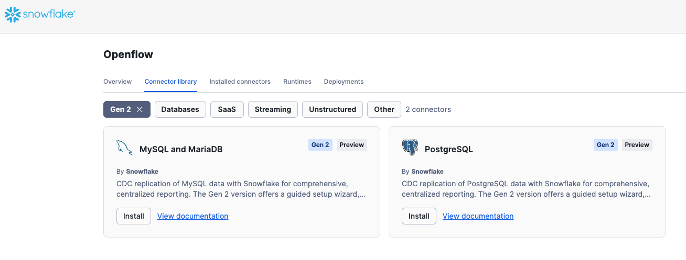
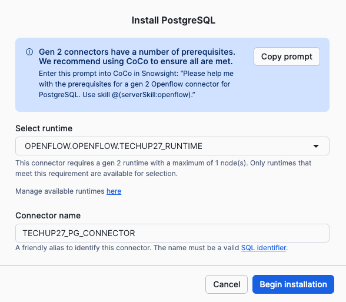
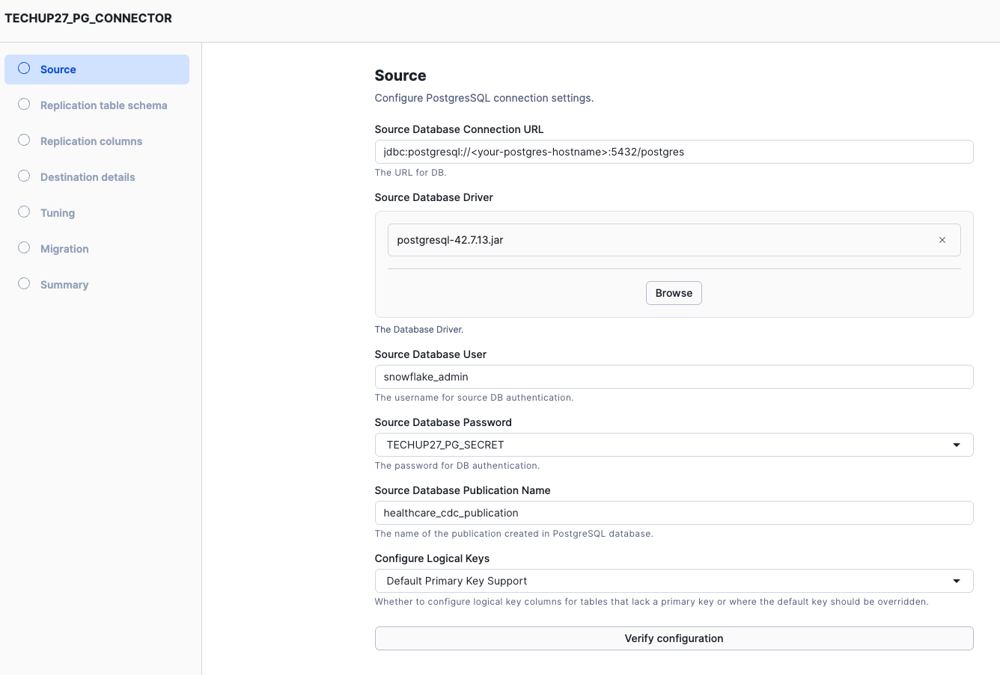
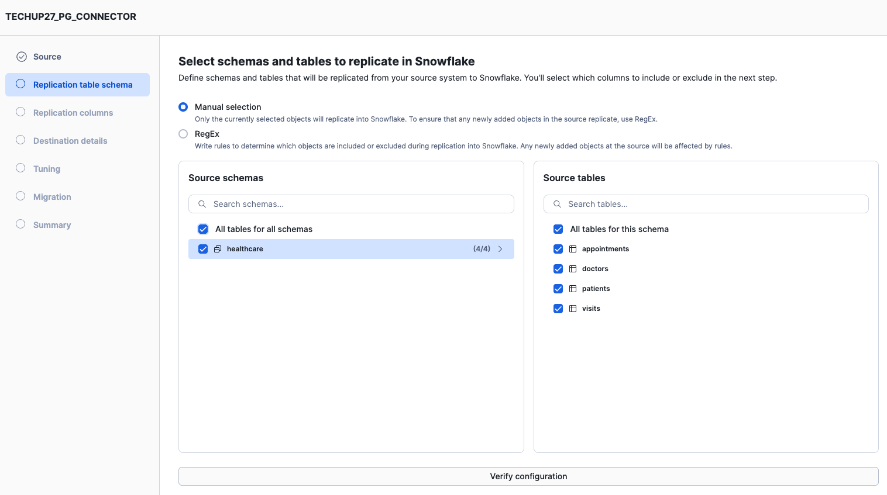
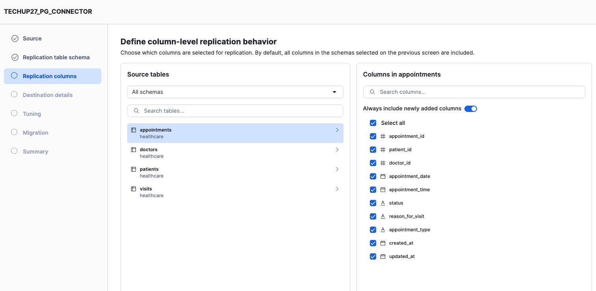
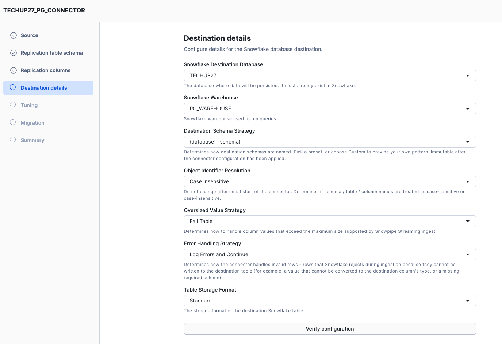
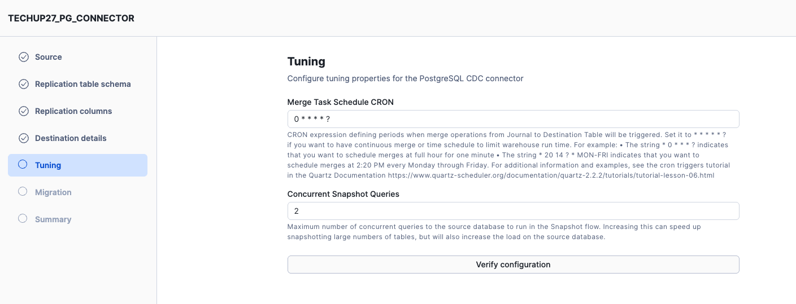
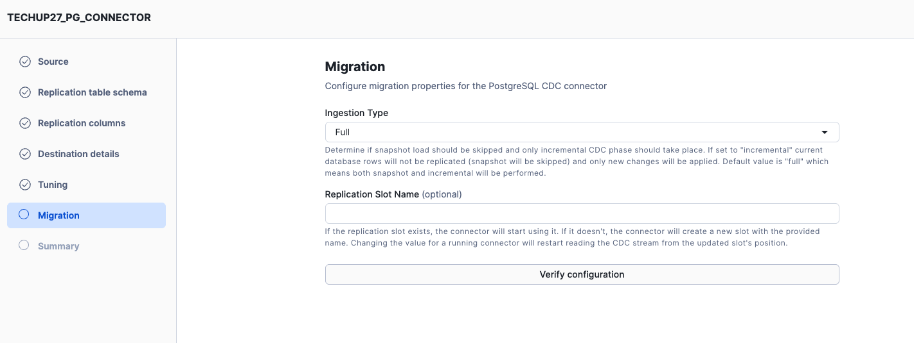
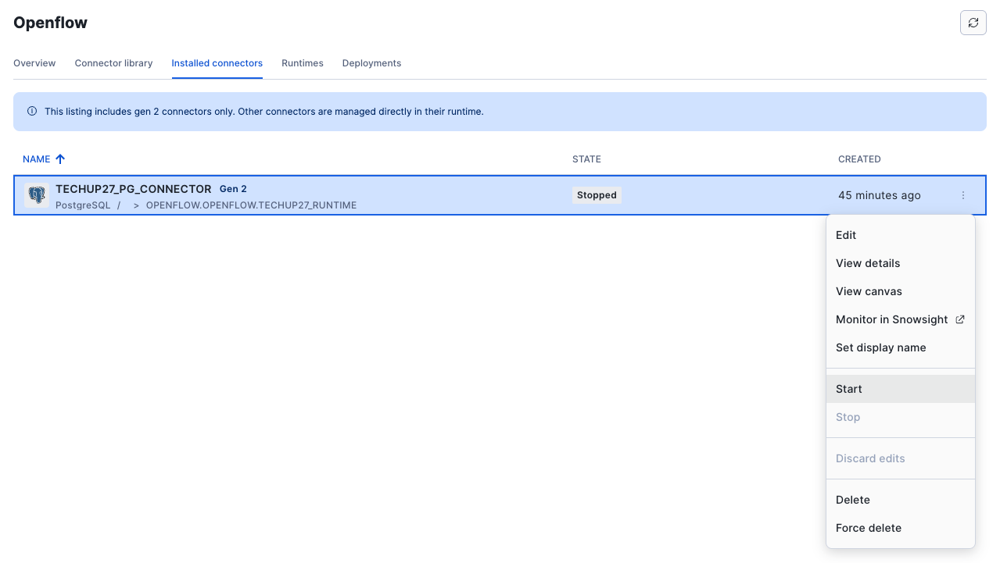
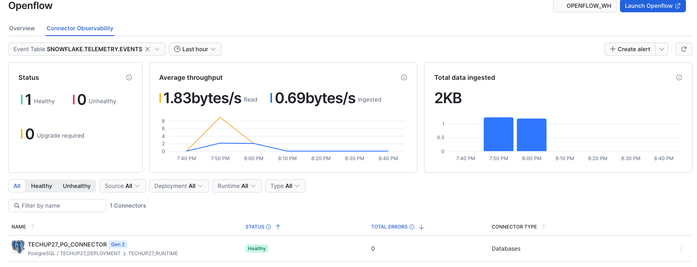

# TechUp27 — Usecase 2: PostgreSQL CDC with Openflow

**"Healthcare Data Replication"** — Real-time CDC from Snowflake Managed Postgres to Snowflake via Openflow

| | |
|---|---|
| **Duration** | 30–40 minutes |
| **Audience** | First-time Openflow users familiar with Postgres |
| **Source** | Snowflake Managed Postgres (healthcare dataset) |

---

## Goal

Set up a real-time Change Data Capture (CDC) pipeline that replicates a healthcare appointment management database from Snowflake Managed Postgres into Snowflake using the Openflow PostgreSQL connector. The pipeline performs a full initial snapshot, then streams every INSERT and UPDATE in near real-time.

---

## Files

| File | Description | Run where |
|------|-------------|-----------|
| [`1.Snowflake_setup.sql`](./1.Snowflake_setup.sql) | Master guide: Postgres instance, network policy, DBeaver connection, Openflow deployment/runtime/EAI | Snowflake SQL Worksheet |
| [`2.Postgres_setup.sql`](./2.Postgres_setup.sql) | Healthcare schema, synthetic data (100 patients, 10 doctors, 170 appointments, 100 visits), CDC publication | DBeaver (Postgres) |
| [`3.Cleanup.sql`](./3.Cleanup.sql) | Tear down all resources (database, warehouse, EAI, network policy, Postgres instance) | Snowflake |
| `README.md` | This file — overview + step-by-step guide. | |

---

## Prerequisites (complete before the session)

1. **Before session prerequisites script** — This should be completed before the session. Skip this step if already completed. If you haven't already, run the [`prerequisites.sql`](../prerequisites.sql) in a Snowflake SQL Worksheet. This creates:

   - **OPENFLOW_ADMIN** role with required grants
   - **OPENFLOW** database and schema for the runtime
   - **Openflow Deployment** and **Runtime** (SPCS-backed, takes ~20 min to provision)

   The runtime is suspended at the end of the script — each use case will resume it when needed.

2. **Install DBeaver** (or another Postgres client) — needed to run SQL against the Postgres instance

   ```bash
   # macOS
   brew install --cask dbeaver-community
   # Windows: download from https://dbeaver.io/download/
   # Linux: sudo snap install dbeaver-ce
   ```

3. **Snowflake CLI** (optional) — for SQL worksheet alternative

   ```bash
   brew install --cask snowflake-cli
   ```

---

## What You will Learn

### 1. Snowflake Managed Postgres
- Creating a managed Postgres instance from Snowsight
- Network policies with `MODE = POSTGRES_INGRESS` (inbound to Postgres)
- Connecting external clients (DBeaver) to managed Postgres

### 2. PostgreSQL Logical Replication
- `wal_level = logical` (enabled by default on Snowflake Managed Postgres)
- Creating publications for CDC
- How replication slots track WAL position

### 3. Openflow CDC Connector
- Deploying a pre-built connector from the Snowflake Connector Registry
- Configuring source (JDBC URL, publication), destination (DB, role, warehouse), and ingestion parameters
- Ingestion type `full` = initial snapshot + incremental streaming
- Table regex filtering (`healthcare\\..*`)
- CRON-based merge schedule

### 4. External Access Integration (EAI) for SPCS
- `MODE = EGRESS` (outbound from Openflow to Postgres) vs `MODE = POSTGRES_INGRESS` (inbound to Postgres)
- Both are needed: one lets DBeaver connect IN, the other lets Openflow connect OUT

### 5. Real-Time CDC Verification
- INSERT propagation from Postgres to Snowflake within ~30–60 seconds
- UPDATE propagation and verifying changed values
- Monitoring snapshot vs incremental replication states

### 6. Case-Sensitive Identifiers
- `CASE_SENSITIVE` object identifier resolution preserves PostgreSQL lowercase naming
- Snowflake queries require double-quoting: `SELECT * FROM QUICKSTART_PGCDC_DB."healthcare"."patients"`

---

## Pipeline Architecture

```
Snowflake Managed Postgres (healthcare schema)
  │
  │  4 tables: patients, doctors, appointments, visits
  │
  ▼
Logical Replication (WAL)
  │  Publication: healthcare_cdc_publication
  │
  ▼
Openflow PostgreSQL CDC Connector (NiFi on SPCS)
  │  1. Full initial snapshot (all 4 tables)
  │  2. Incremental CDC streaming (INSERT/UPDATE/DELETE)
  │
  ▼
Snowflake tables (QUICKSTART_PGCDC_DB."healthcare".*)
```

---

## Step-by-Step

### Step 1: Snowflake Setup (Postgres Instance, Network, Roles & EAI)

Open [`1.Snowflake_setup.sql`](./1.Snowflake_setup.sql) as ACCOUNTADMIN in a Snowflake SQL Worksheet. Run it Step-by-Step! This script creates:

1. **Snowflake Managed Postgres instance** (`dev_test`) — save the credentials from the output
2. **Network policy** with `MODE = POSTGRES_INGRESS` — allows DBeaver and Openflow to reach Postgres
3. **Role grants** (`OPENFLOW_ADMIN`), **warehouse** (`PGCDC_WH`), and **destination database** (`TECHUP27`)
4. **Network rule + EAI** (`TECHUP27_PGCDC_EAI`) and attach to existing Openflow Runtime — outbound from Openflow (SPCS) to Postgres

> **Remember:** Update the `$pg_hostname` variable in the script with your actual Postgres hostname before running the EAI section.

---

### Step 2: Connect to Postgres via DBeaver

1. Open DBeaver > **Database** > **New Database Connection**
2. Select **PostgreSQL** > **Next**
3. Fill in:

| Field | Value |
|-------|-------|
| **Host** | `<your-instance-hostname>.postgres.snowflake.app` |
| **Port** | `5432` |
| **Database** | `postgres` |
| **Username** | `snowflake_admin` |
| **Password** | (from Step 1) |

4. Click **Test Connection** — should show "Connected"
5. Click **Finish**

Verify with:
```sql
SELECT version();
```
You should see PostgreSQL 18.x output.

---

### Step 3: Create Healthcare Demo Data (in DBeaver)

Open [`2.Postgres_setup.sql`](./2.Postgres_setup.sql) in **DBeaver** and run it against your Postgres instance Step-by-Step! This creates:

- **`healthcare` schema** with 4 tables: `patients`, `doctors`, `appointments`, `visits`
- **Synthetic data:** 10 doctors, 100 patients, 170 appointments, 100 visits
- **Indexes** for query performance

Verify row counts:
```sql
SELECT 'patients' AS table_name, COUNT(*) AS row_count FROM healthcare.patients
UNION ALL SELECT 'doctors', COUNT(*) FROM healthcare.doctors
UNION ALL SELECT 'appointments', COUNT(*) FROM healthcare.appointments
UNION ALL SELECT 'visits', COUNT(*) FROM healthcare.visits
ORDER BY table_name;
```

Should return : appointments 170, doctors 10, patients 100, visits 100

---

### Step 4: Check Postgres for CDC Replication configuration (in DBeaver)

This is also part of [`2.Postgres_setup.sql`](./2.Postgres_setup.sql). Verify the publication:

```sql
-- Verify wal_level is logical (enabled by default on Snowflake Managed Postgres)
SHOW wal_level;

-- Verify
SELECT * FROM pg_publication;
SELECT * FROM pg_publication_tables WHERE pubname = 'healthcare_cdc_publication';
```

Should return: 4 tables

---

### Step 5: Deploy the Postgres Connector using UI


**5.1** Open the Openflow page and navigate to **Connector library**, filter on **Gen 2** connectors.

**5.2** Click **Install** on the **PostgreSQL** Gen2 connector



**5.3** Select the Openflow Runtime created in prerequisites step, give it a Name **`TECHUP27_PG_CONNECTOR`** and **Begin installation**

> Note: If you get the **Error: Role needs CREATE OPENFLOW CONNECTOR privilege on the runtime**. Run the following (it's part of prerequisites):


```SQL
USE ROLE ACCOUNTADMIN;

GRANT CREATE OPENFLOW CONNECTOR ON SCHEMA OPENFLOW.OPENFLOW TO ROLE OPENFLOW_ADMIN;
```




### Step 6: Configure Postgres Connector using Wizard

#### **6.1 Source:**

Configure PostgresSQL connection settings.

| Parameter | Value |
|-----------|-------|
| **Source Database Connection URL** | `jdbc:postgresql://<your-postgres-hostname>:5432/postgres` |
| **Source Database Driver** | (Download latest Jar driver for Java 8 from here: https://jdbc.postgresql.org/download/) |
| **Source Database User** | `snowflake_admin` |
| **Source Database Password** | `TECHUP27_PG_SECRET` |
| **Source Database Publication Name** | `healthcare_cdc_publication` |
| **Configure Logical Keys** | `Default Primary Key Support` |

And Click **Verify configuration** and if all is Green, Click **Next** to go to replication section.



#### **6.2 Replication Table Schema:**

Define schemas and tables that will be replicated from your source system to Snowflake.

Use **Manual selection** and Select **healthcare** schema and **All tables for this schema**.

Click **Verify configuration** and **Next** if all good.



#### **6.3 Replication columns:**

Choose which columns are selected for replication.

By default, **all columns** in the tables selected on the previous screen are included. Just make sure all 4 tables are listed in **Source tables**.

Click **Next**.



#### **6.4 Destination details:**

Configure details for the Snowflake database destination.

| Parameter | Value |
|-----------|-------|
| **Snowflake Destination Database** | `TECHUP27` |
| **Snowflake Warehouse** | `PG_WAREHOUSE` |
| **Destination Schema Strategy** | `{database}_{schema}` |
| **Object Identifier Resolution** | `Case Insensitive` |
| **Oversized Value Strategy** | `Fail Table` |
| **Error Handling Strategy** | `Log Errors and Continue` |
| **Table Storage Format** | `Standard` |

> **Note on Object Identifier Resolution:** `CASE_SENSITIVE` preserves PostgreSQL lowercase naming. Snowflake queries require quoting: `SELECT * FROM QUICKSTART_PGCDC_DB."healthcare"."patients"`. We will use Case Insensitive for this lab.

Click **Verify configuration** and **Next** if all good.



#### **6.5 Tuning:**

Configure tuning properties for the PostgreSQL CDC connector

Leave everything default and Click **Next**.



#### **6.6 Migration:**

Configure migration properties for the PostgreSQL CDC connector

> **Note on Ingestion Type:** `Full` = full initial snapshot + incremental CDC streaming. `Incremental` would skip the snapshot and only capture future changes.

Leave everything default and Click **Next**.



#### **6.7 Summary:**

Review your connector configuration before applying changes.

Click **Verify configuration** and if all Click **Apply**

The Update will take 2-3 minutes. After that **Start the connector**.



---

### Step 7: Verify the Pipeline

Monitor the connector in the Openflow dashboard. Tables progress through: `NEW` > `SNAPSHOT_REPLICATION` > `INCREMENTAL_REPLICATION`. The initial snapshot completes within 1–2 minutes for this dataset.

#### **Explore the newly created schema and tables**

```sql
USE ROLE OPENFLOW_ADMIN;
USE WAREHOUSE PG_WAREHOUSE;
USE DATABASE TECHUP27;
SHOW SCHEMAS;
-- you can see a new schema POSTGRES_HEALTHCARE

USE SCHEMA POSTGRES_HEALTHCARE;

-- Check tables were created
SHOW TABLES;
```

You should see **4 new tables** created.

#### **Verify row counts match source**

```sql
SELECT 'patients' AS tbl, COUNT(*) AS cnt FROM PATIENTS
UNION ALL SELECT 'doctors', COUNT(*) FROM DOCTORS
UNION ALL SELECT 'appointments', COUNT(*) FROM APPOINTMENTS
UNION ALL SELECT 'visits', COUNT(*) FROM VISITS
ORDER BY tbl;
```

Expected:

| TBL | CNT |
|-----|-----|
| appointments | 170 |
| doctors | 10 |
| patients | 100 |
| visits | 100 |

#### **Sample query on replicated data**

```sql
SELECT 
    d.FIRST_NAME || ' ' || d.LAST_NAME AS doctor_name,
    d.SPECIALIZATION,
    COUNT(a.APPOINTMENT_ID) AS total_appointments
FROM APPOINTMENTS a
JOIN DOCTORS d 
    ON a.DOCTOR_ID= d.DOCTOR_ID
GROUP BY d.FIRST_NAME, d.LAST_NAME, D.SPECIALIZATION
ORDER BY total_appointments DESC;
```

Expected: 10 rows with doctors and count of their appointments.

---

### Step 8: Test Real-Time CDC

Now test that changes in Postgres are replicated to Snowflake in real-time.

#### **8.1 Insert new data in postgres** (in DBeaver):
```sql
-- Insert a new patient
INSERT INTO healthcare.patients (first_name, last_name, date_of_birth, email, phone, city, state, insurance_provider)
VALUES ('CDC', 'TestPatient', '2000-01-01', 'cdc.test@email.com', '555-9999', 'San Francisco', 'CA', 'BlueCross');

-- Insert a new appointment
INSERT INTO healthcare.appointments (patient_id, doctor_id, appointment_date, appointment_time, status, reason_for_visit, appointment_type)
VALUES (
    (SELECT patient_id FROM healthcare.patients WHERE last_name = 'TestPatient'),
    1,
    CURRENT_DATE + 1,
    '10:00:00',
    'scheduled',
    'CDC test appointment - should appear in Snowflake',
    'routine'
);
```

#### **8.2 Verify in Snowflake** (wait ~30–60 seconds):

Check the new patient is replicated in snowflake:

```sql
SELECT FIRST_NAME, LAST_NAME, EMAIL
FROM PATIENTS
WHERE LAST_NAME = 'TestPatient';
```

Should return 1 row for the newly inserted patient.

Check new appointment:

```sql
SELECT APPOINTMENT_TYPE, STATUS, REASON_FOR_VISIT
FROM APPOINTMENTS
WHERE REASON_FOR_VISIT ILIKE '%CDC test%';
```

Should return 1 row for the newly inserted appointment.

#### **8.3 Test UPDATE in postgres** (in DBeaver):

Update the test patient's city:

```sql
UPDATE healthcare.patients 
SET city = 'Los Angeles'
WHERE last_name = 'TestPatient';
```

#### **8.4 Verify UPDATE in Snowflake** (wait ~30–60 seconds):

Check the new patient city:

```sql
SELECT FIRST_NAME, LAST_NAME, CITY
FROM PATIENTS
WHERE LAST_NAME = 'TestPatient';
```

Should show city = 'Los Angeles' now.


#### **8.5 Check the Journal table for debugging**

Every replicated table from postgres has a Journal table in Snowflake, that captures all the incoming changes before they are applied to the target table.

```sql
SHOW TABLES LIKE 'PATIENTS%';

-- you should see a table containing JOURNAL in the name

SELECT *
FROM PATIENTS_JOURNAL_1789148349_1
WHERE PAYLOAD__LAST_NAME = 'TestPatient'
ORDER BY SEEN_AT DESC;
```

Check the metadata columns `EVENT_TYPE` and `SEEN_AT` to get an idea which events came at which timestamp.

#### **8.6 Check Connector Dashboard**

On the Openflow > Installed Connectors Page Click **The three dots** and select **Monitor in Snowsight** to go to the Connector Dashboard.

Here you can see all the activities of the connector, as well as the errors that might appear. Make sure you are using the **ACCOUNTADMIN** Role.



---

## Success Criteria

The lab is complete when:
- All 4 tables replicated with correct row counts (patients: 100, doctors: 10, appointments: 170, visits: 100)
- CDC test: new patient + appointment appear in Snowflake within ~60 seconds
- UPDATE propagation: city change reflected in Snowflake
- Attendee understands the snapshot → incremental CDC pattern

---

## Cleanup

When done, run [`3.Cleanup.sql`](./3.Cleanup.sql) to tear down all resources:

Also delete the Openflow Runtime from the Openflow UI to stop incurring costs.

---

## Gotchas and Tips

1. **Two network rules needed.** `POSTGRES_INGRESS` lets DBeaver/clients connect TO Postgres. `EGRESS` lets Openflow connect FROM SPCS to Postgres. Missing either one causes connection failures.

2. **Case-sensitive identifiers.** With `CASE_SENSITIVE` resolution, all Snowflake queries must double-quote schema and table names: `"healthcare"."patients"`. Use `CASE_INSENSITIVE` if you prefer standard Snowflake uppercase naming.

3. **Full vs Incremental ingestion.** Use `Full` for new pipelines (snapshot + CDC). Use `Incremental` only if you want to skip the initial snapshot and only capture future changes.

4. **Merge schedule.** The CRON expression `0 * * * * ?` runs the merge every minute. In production, tune this based on your latency requirements.

5. **Replication lag.** CDC changes typically appear in Snowflake within 30–60 seconds. The delay includes WAL read → connector processing → Snowpipe Streaming → merge.

6. **JDBC driver.** Newer connector versions (0.64.0+) include the PostgreSQL JDBC driver automatically. If prompted, download `postgresql-42.7.13.jar` from postgres jdbc maven Central.

7. **0.0.0.0/0 network rule.** The demo uses wide-open access. In production, restrict to specific CIDRs after identifying the Openflow runtime IP range.
